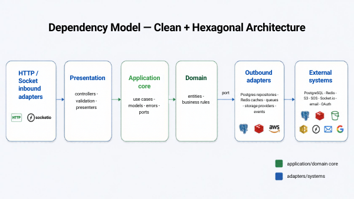

# Strong Together Backend (v5.1.0)

<div align="center">

**A production-oriented fitness platform backend built as a secure modular monolith with explicit distributed-system boundaries.** Strong Together combines a Clean/Hexagonal NestJS core, pragmatic CQRS, PostgreSQL row-level security, typed Zod contracts, Redis-backed caching and realtime delivery, Bull workers, and an event-driven S3/SQS Python computer-vision pipeline. It serves identity, workouts, analytics, scheduling, social crews, messaging, reminders, media, and notifications without turning tightly related product domains into premature microservices.

[](https://github.com/kobihanoch/Strong-Together-Backend/actions)


[API Reference](./docs/api-documentation.md) | [Architecture](./docs/architecture.md) | [Run Locally](./docs/scripts-usage.md) | [Security](./docs/security-deep-dive.md)

</div>

## At A Glance

| Area                 | What is implemented                                                                                                                                                                       |
| -------------------- | ----------------------------------------------------------------------------------------------------------------------------------------------------------------------------------------- |
| **Product domains**  | Authentication and OAuth, user profiles, workout plans and tracking, PRs and analytics, aerobics, weekly schedules, social crews and feeds, messages, reminders, push, and video analysis |
| **Architecture**     | Modular monolith, Clean Architecture, Hexagonal ports/adapters, command/query separation, domain entities, application-owned units of work                                                |
| **Security**         | DPoP-bound JWTs, refresh rotation, token versioning, role guards, Zod validation, rate limiting, PostgreSQL RLS, least-privilege guest and cron database APIs                             |
| **Async + realtime** | Bull/Redis email and push workers, S3 events to SQS, Python OpenCV/MediaPipe processing, Redis Pub/Sub, authenticated Socket.IO user rooms                                                |
| **Data + contracts** | Drizzle-owned PostgreSQL schema and migrations, explicit repository SQL, security-invoker views, database-independent `@strong-together/shared` Zod contracts                             |
| **Operations**       | Docker Compose development/test stacks, LocalStack, Maildev, Pino logs, request correlation, Sentry trace propagation across the Node/Python boundary                                     |



The synchronous core keeps related business workflows and RLS-bound transactions together. Work that is slow, CPU-heavy, provider-dependent, or independently scalable crosses a deliberate boundary into Redis queues or the S3/SQS media pipeline. Nest modules are composition roots; application code depends on ports, while PostgreSQL, Redis, storage, queues, OAuth providers, and realtime delivery remain adapters.

## Repository Map

```text
src/                  NestJS API, feature modules, shared infrastructure, Drizzle schema
packages/shared/      Plain-Zod HTTP and cross-process contracts
workers/              Bull consumers for email and push delivery
pythonService/        SQS-driven exercise video analysis
scripts/              Database, migration, LocalStack, and diagram automation
docs/                 Architecture, API, security, data, testing, and operations
```

## Quick Start

Requirements: Node.js, npm, Docker, and Docker Compose.

```bash
npm install
npm run db:dev:start
npm run orch:dev
```

The API runs at `http://localhost:5000`; local tooling includes [Maildev](http://localhost:1081), [RedisInsight](http://localhost:5540), and the [S3 explorer](http://localhost:8082). See the [scripts guide](./docs/scripts-usage.md) for focused services, migrations, and tests, or run the complete integration suite with `npm test`.

## Documentation

| Topic                          | Start here                                                                                                                                                                                                                                                                                                                          |
| ------------------------------ | ----------------------------------------------------------------------------------------------------------------------------------------------------------------------------------------------------------------------------------------------------------------------------------------------------------------------------------- |
| **System design**              | [Workout plan replacement](./docs/workout-plan-replacement.md); [Architecture overview and backend map](./docs/architecture.md); [Module structure and dependency rules](./docs/clean-architecture-module-structure.md); [Domain refactoring rules](./docs/refactoring-guidelines/domain-and-persistence-refactoring-guidelines.md) |
| **API and contracts**          | [HTTP API reference](./docs/api-documentation.md); [API and engineering standards](./docs/api-and-standards.md); [Shared contract package](./docs/drizzle-first-shared-package.md)                                                                                                                                                  |
| **Security and authorization** | [Security deep dive](./docs/security-deep-dive.md); [Social authorization and RLS](./docs/social-module-and-authorization.md)                                                                                                                                                                                                       |
| **Database**                   | [Schemas and flows](./docs/database-schemas-and-flows.md); [Migrations and DB pipeline](./docs/migrations-and-db-pipeline.md)                                                                                                                                                                                                       |
| **Async and realtime**         | [Video-analysis pipeline](./docs/video-analysis-pipeline.md); [WebSocket delivery](./docs/websocket-realtime.md)                                                                                                                                                                                                                    |
| **Development and operations** | [Scripts](./docs/scripts-usage.md); [Docker environments](./docs/docker-compose-environments.md); [Environment variables](./docs/environment-example.md); [Testing policy](./docs/testing-policy.md)                                                                                                                                |

## Design Tradeoffs

- **Modular monolith over microservices:** identity, authorization, workouts, and social workflows benefit from one transaction and policy model; workers split out workloads that actually need independent execution.
- **Explicit SQL with Drizzle-owned schema:** migrations and database types stay reproducible, while authorization-sensitive and analytics-heavy queries remain visible and tunable.
- **Realtime-first video results:** analysis results are delivered to authenticated user rooms and are not yet retained as a historical PostgreSQL record.
- **At-least-once media processing:** SQS remains the retry authority; consumers must tolerate redelivery, and the local Python worker processes one message at a time.

Frontend: [Strong-Together-App](https://github.com/kobihanoch/Strong-Together-App)
