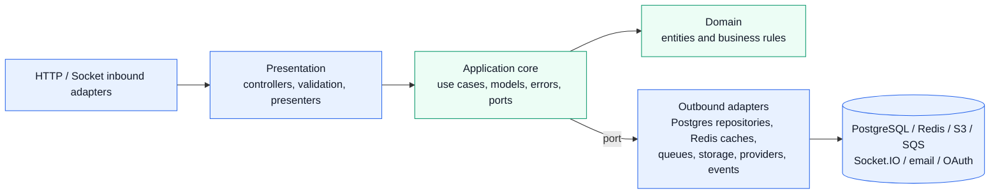
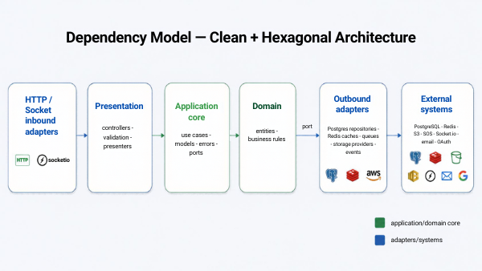
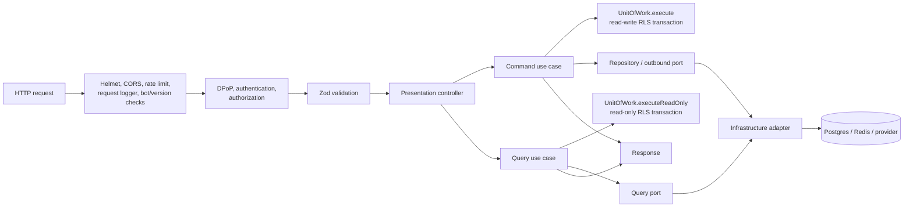
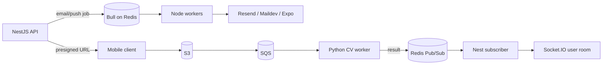
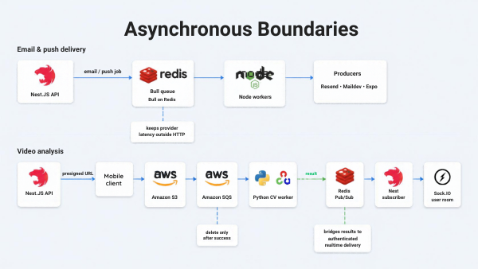

# System Architecture

> **Strong Together is a Clean Architecture, Hexagonal Architecture, and pragmatic CQRS modular monolith.** Clean Architecture keeps dependencies pointing toward application behavior; Hexagonal Architecture places ports around that behavior and implements external concerns as adapters; CQRS separates command and query use cases, ports, SQL, and transaction modes.

The backend combines a NestJS API, PostgreSQL, Redis, Socket.IO, Node workers, and a Python computer-vision worker. It remains a monolith because identity, workouts, social features, messaging, schedules, and authorization share transactions and user context. Slow or failure-prone work crosses explicit asynchronous boundaries.

## Dependency Model





[Edit the Dependency Model diagram in Canva](https://canva.link/bcs24w6bv9eej5j)

The application layer owns its ports. Infrastructure depends on those ports, never the reverse. Nest modules bind port tokens to concrete adapters and act as composition roots. See [Clean Architecture + Hexagonal Architecture Module Structure](./clean-architecture-module-structure.md) for the required feature layout.

## Request Lifecycle



Database-backed use cases own their transaction through the application `UnitOfWork` port. Commands use `execute`, while queries use `executeReadOnly`, which PostgreSQL enforces with `SET TRANSACTION READ ONLY`. Presentation passes the authenticated user ID into the use case; guest operations pass no user ID. `PostgresUnitOfWork` delegates to `DBService`, which sets `app.current_user_id` and the `authenticated` role, or starts with the PostgreSQL `guest` role. Public authentication can promote the active transaction only after credentials or a signed token are verified.

Expected feature failures are transport-neutral application errors. `GlobalExceptionFilter` maps shared error categories to HTTP statuses; application errors do not know about NestJS or HTTP.

## Feature Slice

Non-trivial modules use this shape:

```text
feature/
  domain/                  # optional entities and rules
  application/
    errors/                # feature errors, categorized without HTTP knowledge
    models/                # use-case and port data
    ports/                 # repository/cache/queue/storage/provider contracts
    commands/             # state-changing use cases
    queries/              # read use cases
  infrastructure/
    *.repository.ts        # Postgres adapters
    *.sql.ts               # explicit SQL
    *.db-types.ts          # persistence-only types
    ...                    # Redis, storage, queue, provider, event adapters
  presentation/
    *.controller.ts        # inbound HTTP adapter
  *.module.ts              # dependency-injection composition root
```

This pattern is used across auth, users, workout planning and tracking, schedules, reminders, messages, aerobics, exercises, OAuth, push, social features, video analysis, and WebSocket ticketing. Larger capabilities are split into independently composed submodules.

## Runtime Components

| Component                          | Responsibility                                                                                        |
| ---------------------------------- | ----------------------------------------------------------------------------------------------------- |
| NestJS API                         | HTTP presentation, guards, validation, use-case composition, Socket.IO hosting                        |
| `@strong-together/shared`          | Plain-Zod public request, response, and cross-process contracts; no database schemas or backend types |
| PostgreSQL                         | Domain schemas, explicit repository SQL, views, RLS policies, token state, transactions               |
| Redis                              | Response caches, one-time token/JTI storage, Pub/Sub, Socket.IO scaling, Bull queue storage           |
| Node workers                       | Queue-driven email and push delivery                                                                  |
| Python worker                      | SQS-driven video analysis using OpenCV/MediaPipe utilities                                            |
| S3 / LocalStack / Supabase Storage | Video uploads/events and image storage adapters                                                       |
| SQS / LocalStack                   | Durable video-analysis handoff                                                                        |
| Maildev / Resend / Expo            | Email and push delivery providers                                                                     |
| Sentry / Pino                      | Tracing, error capture, structured operation logging, request correlation                             |

## Feature Modules

| Module                   | Main responsibility                                                | Principal outbound adapters                               |
| ------------------------ | ------------------------------------------------------------------ | --------------------------------------------------------- |
| `auth`                   | Login/refresh/logout, password reset, verification                 | Postgres, JWT, bcrypt, Redis tokens, queued email, events |
| `user`                   | Registration, profile, push tokens, profile pictures, email change | Postgres, storage, Redis/JWT, queued email, events        |
| `workout`                | Plans, completed workouts, history, statistics and PRs             | Postgres repositories, Redis caches                       |
| `workout-schedule`       | Weekly split schedules and atomic replacement                      | Postgres repository, Redis cache                          |
| `reminders` / `push`     | Preferences and scheduled notification enqueueing                  | Postgres, Bull/Redis, Expo worker                         |
| `messages`               | Inbox mutations and realtime publication                           | Postgres, Socket.IO publisher                             |
| `social`                 | Crews, requests, users, posts, comments, reactions, summary        | Postgres, image storage, Socket.IO/message adapters       |
| `video-analysis`         | Upload URL creation and analysis-result publication                | S3, telemetry, Redis subscriber, Socket.IO                |
| `web-sockets`            | Short-lived authenticated socket tickets                           | JWT ticket issuer                                         |
| `aerobics` / `exercises` | Cardio history and exercise catalog                                | Postgres, Redis where applicable                          |
| `oauth`                  | Google and Apple sign-in                                           | Provider verifiers, Postgres, registration/session events |

## Persistence And Transactions

Application use cases depend on repository abstractions such as `WorkoutPlanRepository` and read abstractions such as `WorkoutPlanQueries`; concrete `Postgres*Repository` and `Postgres*Queries` adapters own SQL, Drizzle-derived row types, and mapping. Commands call `UnitOfWork.execute(userId, operation)`, queries call `UnitOfWork.executeReadOnly(userId, operation)`, and best-effort post-commit work is registered through `UnitOfWork.afterCommit(...)`.

`PostgresUnitOfWork` is the infrastructure adapter for this application port. It delegates transaction and callback handling to `DBService`, which binds its `postgres` tagged-template client to the active transaction through `AsyncLocalStorage`. Nested use cases reuse that active transaction. `DBService.sql` rejects access outside a unit of work, preventing accidental non-RLS queries.

After a successful commit, registered callbacks run concurrently and are awaited with `Promise.allSettled`. Rejections are logged through Pino and captured by Sentry, but they do not replace the committed application result with an HTTP error. This is appropriate for best-effort cache and delivery side effects; critical guaranteed delivery should use a transactional outbox.

## Events And Cross-Module Reactions

Lifecycle reactions use application events instead of importing another feature's concrete service. Producers depend on a publisher port; infrastructure publishes the event; the consuming module owns its listener. User registration and first login use this pattern for email/message reactions while preserving module direction.

## Asynchronous Boundaries





[Edit the Asynchronous Boundaries diagram in Canva](https://canva.link/z04iey1f6vhcgeq)

SQS remains the retry authority for video processing because its message is deleted only after successful processing and cleanup. Bull queues keep email and push provider latency outside HTTP requests. Redis Pub/Sub bridges Python results into authenticated Socket.IO delivery.

## Dependency Rules

- Presentation may depend on application use cases and public transport contracts.
- Application may depend on domain code, application models, and application-owned ports.
- Domain code has no NestJS, HTTP, database, cache, queue, or provider dependencies.
- Infrastructure implements ports and owns SQL rows, Redis values, SDK payloads, and mappings.
- Shared public contracts use plain Zod and do not import Drizzle tables, database schemas, repositories, or internal application models.
- Cross-module lifecycle reactions use events; synchronous capabilities cross boundaries through application ports.
