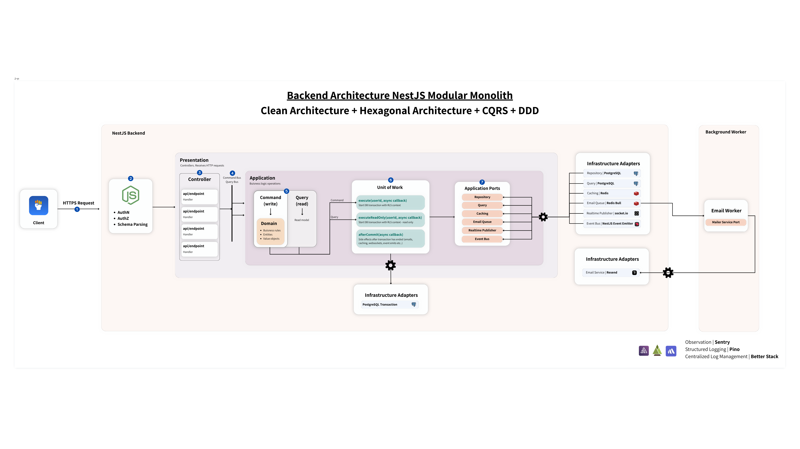
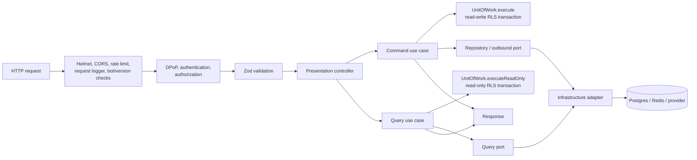
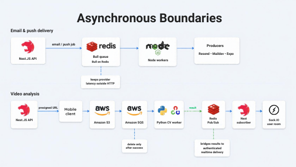

# System Architecture

> **Strong Together is a Clean Architecture, Hexagonal Architecture, and pragmatic CQRS modular monolith.** Clean Architecture keeps dependencies pointing toward application behavior; Hexagonal Architecture places ports around that behavior and implements external concerns as adapters; CQRS separates command and query use cases, ports, SQL, and transaction modes.

The backend combines a NestJS API, PostgreSQL, Redis, Socket.IO, Node workers, and a Python computer-vision worker. It remains a monolith because identity, workouts, social features, messaging, schedules, and authorization share transactions and user context. Slow or failure-prone work crosses explicit asynchronous boundaries.

## Dependency Model


[Edit the Dependency Model diagram in Canva](https://canva.link/bcs24w6bv9eej5j)

## Backend Architecture Map

The backend is a modular monolith with explicit asynchronous boundaries. Features follow the inward dependency model `Presentation -> Application -> Domain`, while infrastructure implements application-owned ports.



### Numbered Request Flow In The Diagram

The numbered path is the normal synchronous HTTP flow. The email worker on the right is an example of work deliberately moved beyond that request boundary.

1. **HTTPS request enters the NestJS API.** The mobile client calls an `api/*` route over HTTPS. `src/app.ts` configures the common application edge: Helmet, CORS, the general rate limiter, request logging, bot filtering, and app-version checks.
2. **Authentication, authorization, and schema validation protect the use case.** Route guards implement DPoP validation, JWT authentication, and role authorization. Controllers apply `ValidateRequestPipe` with the plain-Zod request schemas exported by `@strong-together/shared`. For example, `WorkoutScheduleController` uses `DpopGuard`, `AuthenticationGuard`, `AuthorizationGuard`, `@Roles('user')`, and `replaceWorkoutSchedulesRequestSchema`.
3. **A presentation controller adapts HTTP into an application request.** Controllers extract validated request data and the authenticated user, construct a command or query, and contain no persistence or domain workflow. The controllers under each feature's `presentation/` directory are the concrete implementation of this boundary.
4. **Nest CQRS dispatches to one handler.** `CqrsModule.forRoot()` installs the buses. Controllers send state-changing requests through `CommandBus` and reads through `QueryBus`; decorators such as `@CommandHandler` and `@QueryHandler` bind each message to its handler.
5. **The application handler orchestrates the use case.** Command handlers perform writes and invoke domain entities/value objects to enforce business rules. Query handlers build read models through query ports. For example, `ReplaceWorkoutSchedulesHandler` creates a `WorkoutSchedule` domain entity and saves it through `WorkoutScheduleRepository`, while `GetWorkoutSchedulesHandler` reads through `WorkoutScheduleQueries`.
6. **The Unit of Work owns the database boundary.** Application handlers depend on the `UnitOfWork` application port. Commands call `execute(userId, callback)` for a read-write RLS-aware PostgreSQL transaction; queries call `executeReadOnly(userId, callback)`, which is database-enforced as read-only. `afterCommit(callback)` defers cache changes and delivery side effects until the transaction commits. `PostgresUnitOfWork` is the adapter, and `DBService` supplies the transaction and request-scoped RLS context.
7. **Application-owned ports isolate external systems.** Repository, query, cache, email queue, realtime publisher, and event interfaces live on the application side. Nest feature modules bind them to PostgreSQL/Drizzle, Redis, Bull, Socket.IO, and Nest event-emitter adapters. This is the project's Hexagonal Architecture seam: use cases depend on capability contracts rather than provider implementations.

Email is the asynchronous example shown in the diagram. An application handler registers email enqueueing after commit; the Bull email queue is backed by Redis; the separate Node email worker consumes the job and calls `MailerService`, which selects Maildev in development/test and Resend outside those environments. Worker failures are retried according to the Bull job policy and reported through Pino and Sentry.

### Diagram Scope And Accuracy

The diagram accurately represents the implemented modular-monolith request path and its dependency direction. Two labels should be read as simplified architectural shorthand:

- The box at number 2 groups several stages. Helmet, CORS, rate limiting, bot/version checks, and request logging run as application-edge middleware, while DPoP authentication, authentication, authorization, and Zod parsing run at the route boundary.
- `Mailer Service Port` is conceptual in the current worker implementation. The worker injects the concrete infrastructure `MailerService` directly; it is not presently an application-owned abstract port. The Redis/Bull queue boundary and the Maildev/Resend provider selection are implemented as drawn.

Observability is cross-cutting rather than a single numbered hop: Pino produces structured logs and Sentry captures errors and traces. Better Stack is a deployment-level log destination shown in the diagram; there is no Better Stack transport configured in the application code itself.

```mermaid
flowchart TB
  subgraph actors["External actors"]
    direction LR
    mobile["Mobile client<br/>HTTPS  |  Socket.IO"]
    cron["Scheduled jobs<br/>Cron JWT"]
  end

  edge["APPLICATION EDGE<br/>Helmet  |  CORS  |  Rate limits  |  Bot filter  |  App version  |  Request ID<br/>DPoP  |  JWT  |  Roles  |  Zod validation"]

  subgraph monolith["NESTJS MODULAR MONOLITH"]
    direction TB
    subgraph domains["Business capability sectors"]
      direction LR
      subgraph identity["IDENTITY"]
        direction TB
        auth["<b>Auth</b><br/>Session  |  Password  |  Verification<br/>P  ->  A  ->  D  ->  Ports  <-  I"]
        user["<b>User</b><br/>Create  |  Update  |  Push Tokens<br/>P  ->  A  ->  D  ->  Ports  <-  I"]
        oauth["<b>OAuth</b><br/>Apple  |  Core  |  Google<br/>P  ->  A  ->  D  ->  Ports  <-  I"]
      end
      subgraph fitness["FITNESS"]
        direction TB
        workout["<b>Workout</b><br/>Plan  |  Tracking<br/>P  ->  A  ->  D  ->  Ports  <-  I"]
        schedule["<b>Workout Schedule</b><br/>P  ->  A  ->  D  ->  Ports  <-  I"]
        aerobics["<b>Aerobics</b><br/>P  ->  A  ->  D  ->  Ports  <-  I"]
        catalog["<b>Exercises</b><br/>P  ->  A  ->  Ports  <-  I"]
      end
      subgraph community["COMMUNITY"]
        direction TB
        social["<b>Social Users + Summary</b><br/>P  ->  A  ->  Ports  <-  I"]
        crews["<b>Crews</b><br/>Core  |  Participation Requests<br/>P  ->  A  ->  D  ->  Ports  <-  I"]
        posts["<b>Posts</b><br/>Core  |  Comments  |  Reactions<br/>P  ->  A  ->  D  ->  Ports  <-  I"]
      end
      subgraph delivery["DELIVERY"]
        direction TB
        messages["<b>Messages</b><br/>Inbox  |  System Messages<br/>P or Listener  ->  A  ->  D  ->  Ports  <-  I"]
        reminders["<b>Reminders</b><br/>P  ->  A  ->  D  ->  Ports  <-  I"]
        push["<b>Push</b><br/>Controller  |  Worker<br/>P  ->  A  ->  Ports  <-  I"]
      end
      subgraph media["MEDIA + REALTIME"]
        direction TB
        video["<b>Video Analysis</b><br/>Upload  |  Result Delivery<br/>P or Event  ->  A  ->  Ports  <-  I"]
        sockets["<b>WebSockets</b><br/>Ticketing<br/>P  ->  A  ->  Port  <-  I"]
      end
    end

    appbase["SHARED APPLICATION FOUNDATION<br/>UnitOfWork  |  Application errors  |  Domain errors  |  Events<br/>Operation logger  |  @strong-together/shared contracts"]
    infrabase["INFRASTRUCTURE FOUNDATION<br/>Connections: PostgreSQL  |  Redis  |  AWS<br/>Capabilities: Cache  |  Bull queues  |  Realtime  |  Mailer  |  Storage  |  Observability<br/>Persistence: Drizzle schemas  |  Migrations  |  Seeds  |  RLS"]
    domains --> appbase --> infrabase
  end

  subgraph planes["Runtime and provider planes"]
    direction LR
    subgraph data["DATA PLANE"]
      direction TB
      pg[("PostgreSQL 16<br/>identity  |  workout  |  tracking<br/>schedules  |  reminders  |  messages  |  social")]
      redis[("Redis<br/>Cache  |  Bull  |  Pub/Sub")]
    end
    subgraph async["ASYNC EXECUTION"]
      direction TB
      nodeworkers["Node workers<br/>Email  |  Push"]
      s3["AWS S3<br/>ObjectCreated"]
      sqs["AWS SQS<br/>Video analysis queue"]
      python["Python CV worker<br/>OpenCV  |  MediaPipe"]
      subscriber["Nest Redis subscriber"]
      s3 -. event .-> sqs
      sqs -. long poll .-> python
      python -. results .-> redis
      redis -. Pub/Sub .-> subscriber
    end
    subgraph providers["DELIVERY + PROVIDERS"]
      direction TB
      socketio["Socket.IO<br/>authenticated user rooms"]
      email["Resend  |  Maildev"]
      expo["Expo Push"]
      ids["Apple  |  Google identity"]
      storage["S3  |  Supabase-compatible storage"]
    end
  end

  observe["OBSERVABILITY ENVELOPE<br/>Pino logs  |  Request IDs  |  Sentry traces  |  Cross-runtime propagation"]
  mobile --> edge
  cron --> edge
  edge --> monolith
  infrabase ==> pg
  infrabase ==> redis
  infrabase -. jobs .-> nodeworkers
  infrabase -. uploads .-> s3
  nodeworkers --> email
  nodeworkers --> expo
  subscriber --> socketio
  infrabase --> ids
  infrabase --> storage
  planes --> observe
  monolith --> observe

  classDef actor fill:#ffffff,stroke:#0757b8,stroke-width:2px,color:#111827
  classDef edgeNode fill:#e8f1ff,stroke:#0757b8,stroke-width:2px,color:#111827
  classDef module fill:#ffffff,stroke:#2563eb,stroke-width:1.25px,color:#111827
  classDef foundation fill:#ecfdf5,stroke:#059669,stroke-width:1.5px,color:#111827
  classDef platform fill:#ffffff,stroke:#374151,stroke-width:1.5px,color:#111827
  classDef observability fill:#f5f3ff,stroke:#6d28d9,stroke-width:1.5px,color:#111827
  class mobile,cron actor
  class edge edgeNode
  class auth,user,oauth,workout,schedule,aerobics,catalog,social,crews,posts,messages,reminders,push,video,sockets module
  class appbase,infrabase foundation
  class pg,redis,nodeworkers,s3,sqs,python,subscriber,socketio,email,expo,ids,storage platform
  class observe observability
```

### Architecture Map Legend

| Mark         | Meaning                                                    |
| ------------ | ---------------------------------------------------------- |
| `P`          | Presentation controllers or inbound listeners              |
| `A`          | Application commands, queries, and orchestration           |
| `D`          | Domain aggregates, entities, value objects, and invariants |
| `Ports`      | Application-owned outbound capability contracts            |
| `I`          | Infrastructure adapters implementing application ports     |
| Solid arrow  | Synchronous runtime flow                                   |
| Dotted arrow | Event or asynchronous flow                                 |
| Double arrow | Transactional PostgreSQL access                            |

The application layer owns its ports. Infrastructure depends on those ports, never the reverse. Nest modules bind port tokens to concrete adapters and act as composition roots. See [Clean Architecture + Hexagonal Architecture Module Structure](./clean-architecture-module-structure.md) for the required feature layout.

## Request Lifecycle


```mermaid
flowchart LR
  request[HTTP request] --> middleware[Helmet, CORS, rate limit,<br/>request logger, bot/version checks]
  middleware --> guards[DPoP, authentication,<br/>authorization]
  guards --> validation[Zod validation]
  validation --> controller[Presentation controller]
  controller --> command[Command use case]
  controller --> query[Query use case]
  command --> writeTx[UnitOfWork.execute<br/>read-write RLS transaction]
  query --> readTx[UnitOfWork.executeReadOnly<br/>read-only RLS transaction]
  command --> port[Repository / outbound port]
  query --> queryPort[Query port]
  port --> adapter[Infrastructure adapter]
  queryPort --> adapter
  adapter --> resource[(Postgres / Redis / provider)]
  command --> response[Response]
  query --> response
```

Database-backed use cases own their transaction through the application `UnitOfWork` port. Commands use `execute`, while queries use `executeReadOnly`, which PostgreSQL enforces with `SET TRANSACTION READ ONLY`. Presentation passes the authenticated user ID into the use case; guest operations pass no user ID. `PostgresUnitOfWork` delegates to `DBService`, which sets `app.current_user_id` and the `authenticated` role, or starts with the PostgreSQL `guest` role. Public authentication can promote the active transaction only after credentials or a signed token are verified.

Expected feature failures are transport-neutral application errors. `GlobalExceptionFilter` maps shared error categories to HTTP statuses; application errors do not know about NestJS or HTTP.

## Feature Slice

Non-trivial modules use this shape:

```text
feature/
  domain/                  # optional entities and rules
  application/
    errors/                # feature errors, categorized without HTTP knowledge
    models/                # use-case and port data
    ports/                 # repository/cache/queue/storage/provider contracts
    commands/             # state-changing use cases
    queries/              # read use cases
  infrastructure/
    *.repository.ts        # Postgres adapters
    *.sql.ts               # explicit SQL
    *.db-types.ts          # persistence-only types
    ...                    # Redis, storage, queue, provider, event adapters
  presentation/
    *.controller.ts        # inbound HTTP adapter
  *.module.ts              # dependency-injection composition root
```

This pattern is used across auth, users, workout planning and tracking, schedules, reminders, messages, aerobics, exercises, OAuth, push, social features, video analysis, and WebSocket ticketing. Larger capabilities are split into independently composed submodules.

## Runtime Components

| Component                          | Responsibility                                                                                        |
| ---------------------------------- | ----------------------------------------------------------------------------------------------------- |
| NestJS API                         | HTTP presentation, guards, validation, use-case composition, Socket.IO hosting                        |
| `@strong-together/shared`          | Plain-Zod public request, response, and cross-process contracts; no database schemas or backend types |
| PostgreSQL                         | Domain schemas, explicit repository SQL, views, RLS policies, token state, transactions               |
| Redis                              | Response caches, one-time token/JTI storage, Pub/Sub, Socket.IO scaling, Bull queue storage           |
| Node workers                       | Queue-driven email and push delivery                                                                  |
| Python worker                      | SQS-driven video analysis using OpenCV/MediaPipe utilities                                            |
| S3 / LocalStack / Supabase Storage | Video uploads/events and image storage adapters                                                       |
| SQS / LocalStack                   | Durable video-analysis handoff                                                                        |
| Maildev / Resend / Expo            | Email and push delivery providers                                                                     |
| Sentry / Pino                      | Tracing, error capture, structured operation logging, request correlation                             |

## Feature Modules

| Module                   | Main responsibility                                                | Principal outbound adapters                               |
| ------------------------ | ------------------------------------------------------------------ | --------------------------------------------------------- |
| `auth`                   | Login/refresh/logout, password reset, verification                 | Postgres, JWT, bcrypt, Redis tokens, queued email, events |
| `user`                   | Registration, profile, push tokens, profile pictures, email change | Postgres, storage, Redis/JWT, queued email, events        |
| `workout`                | Plans, completed workouts, history, statistics and PRs             | Postgres repositories, Redis caches                       |
| `workout-schedule`       | Weekly split schedules and atomic replacement                      | Postgres repository, Redis cache                          |
| `reminders` / `push`     | Preferences and scheduled notification enqueueing                  | Postgres, Bull/Redis, Expo worker                         |
| `messages`               | Inbox mutations and realtime publication                           | Postgres, Socket.IO publisher                             |
| `social`                 | Crews, requests, users, posts, comments, reactions, summary        | Postgres, image storage, Socket.IO/message adapters       |
| `video-analysis`         | Upload URL creation and analysis-result publication                | S3, telemetry, Redis subscriber, Socket.IO                |
| `web-sockets`            | Short-lived authenticated socket tickets                           | JWT ticket issuer                                         |
| `aerobics` / `exercises` | Cardio history and exercise catalog                                | Postgres, Redis where applicable                          |
| `oauth`                  | Google and Apple sign-in                                           | Provider verifiers, Postgres, registration/session events |

## Persistence And Transactions

Application use cases depend on repository abstractions such as `WorkoutPlanRepository` and read abstractions such as `WorkoutPlanQueries`; concrete `Postgres*Repository` and `Postgres*Queries` adapters own SQL, Drizzle-derived row types, and mapping. Commands call `UnitOfWork.execute(userId, operation)`, queries call `UnitOfWork.executeReadOnly(userId, operation)`, and best-effort post-commit work is registered through `UnitOfWork.afterCommit(...)`.

`PostgresUnitOfWork` is the infrastructure adapter for this application port. It delegates transaction and callback handling to `DBService`, which binds its `postgres` tagged-template client to the active transaction through `AsyncLocalStorage`. Nested use cases reuse that active transaction. `DBService.sql` rejects access outside a unit of work, preventing accidental non-RLS queries.

After a successful commit, registered callbacks run concurrently and are awaited with `Promise.allSettled`. Rejections are logged through Pino and captured by Sentry, but they do not replace the committed application result with an HTTP error. This is appropriate for best-effort cache and delivery side effects; critical guaranteed delivery should use a transactional outbox.

## Events And Cross-Module Reactions

Lifecycle reactions use application events instead of importing another feature's concrete service. Producers depend on a publisher port; infrastructure publishes the event; the consuming module owns its listener. User registration and first login use this pattern for email/message reactions while preserving module direction.

## Asynchronous Boundaries



[Edit the Asynchronous Boundaries diagram in Canva](https://canva.link/z04iey1f6vhcgeq)

SQS remains the retry authority for video processing because its message is deleted only after successful processing and cleanup. Bull queues keep email and push provider latency outside HTTP requests. Redis Pub/Sub bridges Python results into authenticated Socket.IO delivery.

## Dependency Rules

- Presentation may depend on application use cases and public transport contracts.
- Application may depend on domain code, application models, and application-owned ports.
- Domain code has no NestJS, HTTP, database, cache, queue, or provider dependencies.
- Infrastructure implements ports and owns SQL rows, Redis values, SDK payloads, and mappings.
- Shared public contracts use plain Zod and do not import Drizzle tables, database schemas, repositories, or internal application models.
- Cross-module lifecycle reactions use events; synchronous capabilities cross boundaries through application ports.
