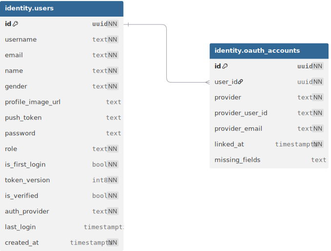
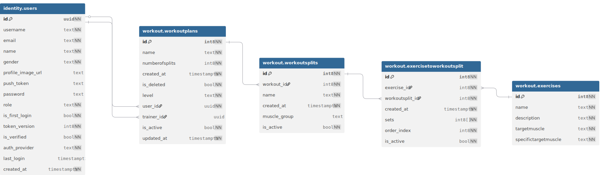
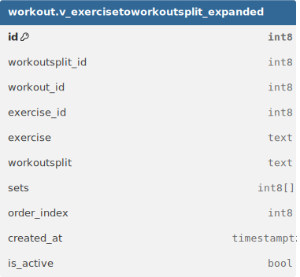
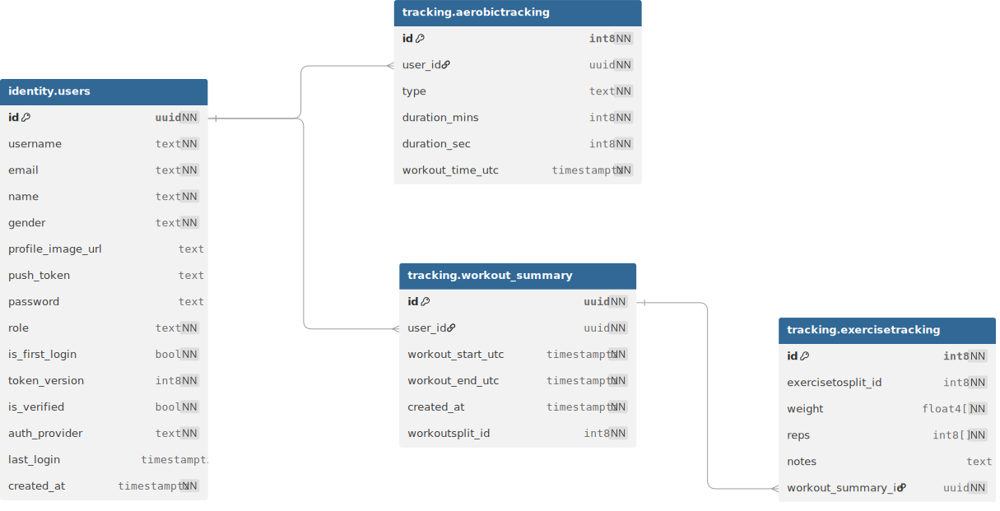
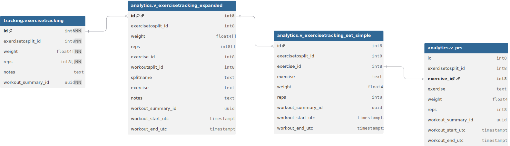
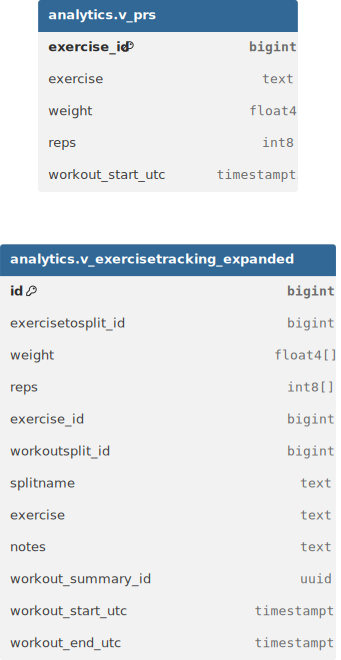
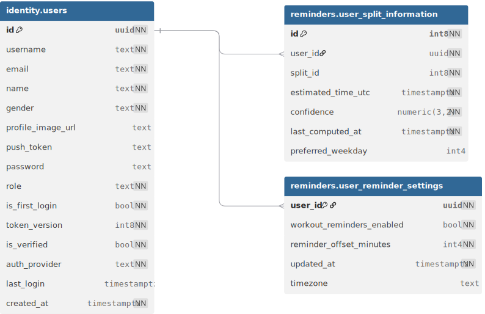
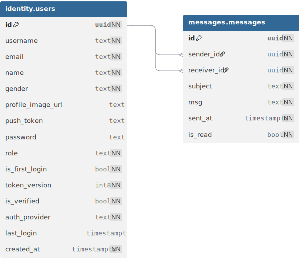

# Database Schemas And Flows

The database is PostgreSQL-first and organized around domain schemas rather than a single overloaded `public` namespace. Atlas migrations live in `src/infrastructure/db/schema/migrations`, and seeds live in `src/infrastructure/db/schema/seeds`.

## Schema Map

| Schema      | Main objects                                                            | Responsibility                                                                           |
| ----------- | ----------------------------------------------------------------------- | ---------------------------------------------------------------------------------------- |
| `identity`  | `users`, `oauth_accounts`, `current_user_id()` support                  | User profile, credentials metadata, roles, verification, OAuth linkage, token versioning |
| `workout`   | `exercises`, `workoutplans`, `workoutsplits`, `exercisetoworkoutsplit`  | Exercise catalog and planned workout structure                                           |
| `tracking`  | `workout_summary`, `exercisetracking`, `aerobictracking`                | Completed workout sessions, set-level strength data, aerobic history                     |
| `reminders` | `user_reminder_settings`, `user_split_information`                      | Reminder preferences and inferred split scheduling data                                  |
| `messages`  | `messages`                                                              | User/system messaging                                                                    |
| `analytics` | `v_exercisetracking_expanded`, `v_exercisetracking_set_simple`, `v_prs` | Read-optimized analytics views                                                           |

## Identity Schema

### Tables



`identity.users` is the security anchor for the application. It stores user identity, role, verification state, password data, profile fields, `token_version`, and `last_login`.

Important flows:

- Login bumps `token_version` and returns access/refresh tokens with the new version.
- Refresh performs a version compare-and-set before issuing new tokens.
- Logout bumps `token_version`, invalidating older access tokens.
- Verification and password flows update identity state while preserving centralized token invalidation.
- `identity.oauth_accounts` links provider identities to application users.

The schema is protected by RLS so authenticated users can read/update/delete only their own profile, with specific exceptions such as message sender visibility.

## Workout Schema

### Tables



### Views



The workout schema separates reusable exercise definitions from user-specific plans.

Core objects:

- `workout.exercises`: exercise catalog readable by authenticated users.
- `workout.workoutplans`: plan owned by a user.
- `workout.workoutsplits`: split/day definitions under a plan.
- `workout.exercisetoworkoutsplit`: ordered exercises inside a split.
- `workout.v_exercisetoworkoutsplit_expanded`: view that expands planned exercises for API reads.

Why this shape matters:

- Exercise metadata stays normalized.
- User plans can evolve without duplicating the catalog.
- Ordered split exercises support practical workout UX.
- RLS policies tie nested split/exercise rows back to the owning plan.

## Tracking Schema

### Tables



### Views



The tracking schema captures performed activity, not planned activity.

Core objects:

- `tracking.workout_summary`: a completed workout session.
- `tracking.exercisetracking`: set-level lifting data linked to a workout summary.
- `tracking.aerobictracking`: cardio history.

Important indexes:

- `workout_summary_user_start_utc_idx` supports user timeline queries.
- `workout_summary_start_date_idx` supports date-based grouping.
- `exercisetracking_workout_summary_id_idx` supports session detail expansion.
- `aerobictracking_user_id_workout_time_utc_idx` supports cardio history reads.

The RLS model protects nested set rows by checking ownership through `workout_summary`.

## Analytics Schema

### Views



Analytics is modeled through security-invoker views:

- `analytics.v_exercisetracking_expanded`
- `analytics.v_exercisetracking_set_simple`
- `analytics.v_prs`

Security-invoker views are an important choice because they preserve caller RLS behavior. Analytics queries can be expressive and reusable without accidentally becoming privileged read paths.

The API uses these views for higher-level fitness insights such as personal records, RM-oriented data, and goal adherence.

## Reminders Schema

### Tables



Reminder data is split between explicit settings and inferred schedule intelligence:

- `reminders.user_reminder_settings`: user-owned reminder preferences.
- `reminders.user_split_information`: preferred weekday and confidence data for split scheduling.

The confidence index on `preferred_weekday` and `confidence` exists because reminders are not just CRUD settings; they are time-sensitive operational queries.

## Messages Schema

### Tables



`messages.messages` supports user and system messages.

RLS allows participants to read/update/delete messages where they are sender or receiver. Insert policy also allows a known system sender ID, which supports automated application messages without giving every user broad write access.

## RLS Flow

Authenticated controller routes use `RlsTxInterceptor`:

```text
HTTP request -> AuthenticationGuard -> req.user.id -> RlsTxInterceptor -> DB transaction
```

Inside the transaction:

```sql
select set_config('app.current_user_id', <user-id>, true);
SET LOCAL ROLE authenticated;
```

Queries then execute against PostgreSQL policies that call `identity.current_user_id()` or related helpers. The application and database agree on the same current user.

## Migration Lifecycle

Normal schema workflow:

```bash
npm run db:dev:start
npm run db:migrate:diff -- add_feature_name
npm run db:dev:migrate
npm run test:db:reset
```

The key engineering rule: schema state must be reproducible from committed migrations. Local mutations are not the source of truth until Atlas captures them as migration files.
