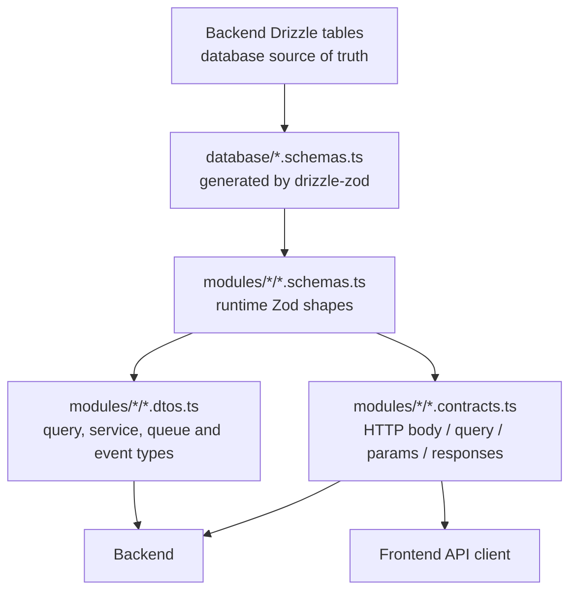

# Drizzle-first shared package

The backend owns the Drizzle configuration and database tables. The publishable `@strong-together/shared` package lives inside the backend repository, derives its database-backed fields from those tables, and is installed by the frontend. There is no `*Entity` layer and no handwritten copy of a database model.

## Dependency diagram



The arrows are one-way. Contracts and DTOs depend on schemas; schemas depend on generated Drizzle schemas. Drizzle tables never depend on the shared package.

## What belongs in each folder?

### `database/`

This is the bridge to the backend-owned Drizzle tables. It contains generated Zod schemas and direct Drizzle inference:

```ts
export const userDbSchema = createSelectSchema(user);
export const userInsertDbSchema = createInsertSchema(user);
export const userUpdateDbSchema = createUpdateSchema(user);

export type UserRow = typeof user.$inferSelect;
export type UserInsert = typeof user.$inferInsert;
```

Put nothing HTTP-specific here. If a database column changes, change its Drizzle table; this layer follows it.

### `modules/<feature>/*.schemas.ts`

These are the runtime Zod definitions. Put request envelopes, response objects, computed SQL shapes, and external event/queue payload schemas here.

Zod-first applies to every boundary value:

- HTTP `body`, `query`, and `params`
- HTTP responses
- queue and Redis messages
- JWT/session payloads
- third-party or worker payloads consumed by the backend

It does not mean every private local variable or internal SQL CTE needs a Zod schema.

Database-backed fields reuse a Drizzle-generated field schema:

```ts
export const allUserMessageSchema = z.object({
  id: messageDbSchema.shape.id,
  subject: messageDbSchema.shape.subject,
  msg: messageDbSchema.shape.msg,
  sentAt: serializedDateSchema,
  isRead: messageDbSchema.shape.isRead,
  senderFullName: userDbSchema.shape.name,
  senderProfilePicPath: userDbSchema.shape.profilePicPath,
});
```

Only genuinely computed or transport-only fields are defined directly with Zod. Examples are `tz`, `password`, `numberOfSplits`, `durationMins`, and `adherencePct`; there is no Drizzle column from which those fields can be derived.

### `modules/<feature>/*.contracts.ts`

Contracts expose public HTTP TypeScript names inferred from schemas. They do not redefine fields:

```ts
export type ListMessagesResponse = z.infer<typeof listMessagesResponseSchema>;
export type FinishWorkoutBody = z.infer<typeof finishWorkoutRequest.shape.body>;
```

The request-envelope convention has only the relevant sections:

```ts
{ body: ... }
{ query: ... }
{ params: ... }
{ body: ..., query: ... }
```

Use contracts in controllers and in the frontend API client.

### `modules/<feature>/*.dtos.ts`

DTOs are inferred types behind the HTTP layer: SQL result rows, service inputs, queue jobs, Redis events, and useful schema projections. A DTO must not manually duplicate fields already present in a schema:

```ts
export type AllUserMessages = z.infer<typeof allUserMessageSchema>;
```

If a DTO and contract have the same shape, reuse the schema or existing inferred type. Do not create a second object declaration.

## Daily development order

1. If persisted data changes, edit the backend Drizzle table first.
2. Export or update its generated schema in `database/`.
3. Compose the feature Zod schema in `*.schemas.ts`, using `dbSchema.shape.field` for database values.
4. Infer the HTTP type in `*.contracts.ts` when a controller/frontend uses the shape.
5. Infer a type in `*.dtos.ts` only when a query, service, queue, or event needs it internally.
6. Make SQL aliases and JSON keys match the schema exactly.
7. Parse untrusted boundary input with Zod; do not use a type assertion as validation.
8. Build the shared package, typecheck the backend, and run relevant tests.

For an endpoint-only change, normally start at step 3. For a database change, start at step 1.

## Naming policy

All TypeScript-visible request, response, DTO, queue, and event fields use `camelCase`. PostgreSQL columns may remain `snake_case`; SQL translates them with quoted aliases or explicit JSON keys:

```sql
SELECT
  m.sent_at AS "sentAt",
  m.is_read AS "isRead"
FROM messages.message m;
```

Profile-picture storage references are consistently named `profilePicPath`; message sender projections use `senderProfilePicPath`. The upload endpoint separately returns `url` for the actual public URL. Physical storage/database names such as `profile_pic_path` do not leak into HTTP contracts.

Existing exported contract names remain unchanged. Removed database/query fields are removed instead of retained as fictional compatibility fields.

## No-duplication policy

```text
Database fields       -> Drizzle tables
Database Zod schemas  -> drizzle-zod generation
Boundary schemas      -> Zod composition using Drizzle fields
Contracts and DTOs    -> z.infer from those schemas
Computed fields       -> explicit Zod fields only where no DB column exists
Handwritten entities  -> none
Handwritten API types -> none
```

The same field name may be displayed in a schema and its inferred TypeScript type, but it is declared only once: in the Zod schema. That is inference, not duplication.
