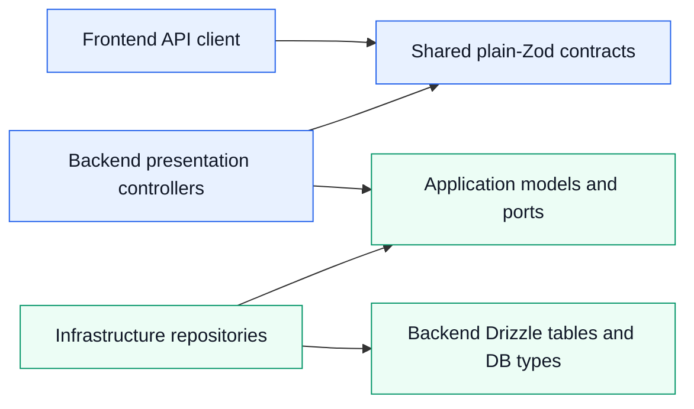

# Database-Isolated Shared Contract Package

The publishable `@strong-together/shared` package contains public request, response, and cross-process contracts. It uses plain Zod and is deliberately isolated from the backend database model.

> **This separation enforces Clean Architecture and Hexagonal Architecture:** transport contracts sit at the system boundary, while Drizzle tables and persistence types remain inside backend infrastructure adapters.

## Dependency Direction

There is no dependency from `packages/shared` to Drizzle, backend entities, application models, repositories, SQL types, or infrastructure. The backend and frontend may both consume shared contracts; physical database design remains private to the backend.

## Package Contents

- `common/`: reusable transport-only schemas and contract types.
- `modules/<feature>/*.schemas.ts`: runtime Zod request, response, and event schemas.
- `modules/<feature>/*.contracts.ts`: TypeScript types inferred from those schemas.

Legacy `*.dtos.ts` and the former `database/` schema layer have been removed. Internal repository inputs/results and SQL row types now belong in backend application or infrastructure folders, according to their role.

## Contract Rules

- Define public boundary validation with ordinary Zod primitives and reusable transport schemas.
- Infer exported TypeScript types with `z.infer`; do not hand-copy a schema as an interface.
- Keep HTTP and event fields camelCase. Repositories map PostgreSQL snake_case names at the infrastructure boundary.
- Do not export database rows, insert/update types, query DTOs, internal JWT payloads, or provider SDK types.
- Parse untrusted HTTP, queue, Redis, and worker payloads at their boundary.
- Preserve established public schema and contract names unless an API change is intentional.

## Backend Type Ownership

| Type | Owner |
| --- | --- |
| Public HTTP request/response or cross-process event | `packages/shared` plain-Zod schema/contract |
| Use-case command, result, or repository-facing read model | `application/models/*.models.ts` |
| Repository/cache/queue/storage abstraction | `application/ports/*` |
| SQL row, insert/update shape, provider payload | `infrastructure/*.db-types.ts` or adapter-local type |
| Drizzle table/view definition | `src/infrastructure/db/schema/drizzle` |

## Development Flow

1. For an API change, update the relevant plain-Zod shared schema and inferred contract.
2. Update the presentation controller mapping without passing HTTP objects into the use case.
3. Update application models or ports only when the use-case boundary changes.
4. For persistence changes, edit backend Drizzle tables and repository-local DB types independently.
5. Map between database rows, application models, and public contracts at the owning boundary.
6. Build the shared package, typecheck the backend, and run the relevant integration tests.

This permits the database and public API to evolve independently and prevents PostgreSQL concerns from leaking into clients or the application core.
