# Workout Plan Replacement

This guide explains how `PUT /api/workout-plan` replaces an authenticated user's complete workout-plan snapshot. It covers the API boundary, domain decisions, RLS transaction, ordered persistence operations, rollback behavior, and post-commit cache invalidation.

## Workout Plan Replacement Flow

`PUT /api/workout-plan` treats the submitted plan as a complete snapshot. The current plan is locked before the domain decides what remains active, persistence is atomic, and cache invalidation begins only after a successful commit.

```mermaid
flowchart LR
  client["Mobile client<br/><b>Complete snapshot</b><br/>splits  |  exercises  |  sets"]

  subgraph edge["1  |  API boundary"]
    direction TB
    controller["WorkoutPlanController<br/><b>PUT /api/workout-plan</b>"]
    security["DPoP  |  JWT  |  user role<br/>Zod validation"]
    controller --> security
  end

  subgraph app["2  |  Application and domain"]
    direction TB
    usecase["ReplaceWorkoutPlanUseCase"]
    begin["Begin authenticated<br/><b>RLS transaction</b>"]
    find["WorkoutPlanRepository<br/><b>findForUpdate</b>"]
    adapter["PostgresWorkoutPlanRepository"]
    lock["Lock active plan<br/><b>FOR UPDATE</b>"]
    exists{"Existing plan?"}
    restore["Restore WorkoutPlan aggregate"]
    replace["replaceSplits snapshot<br/>preserve owned IDs<br/>update submitted splits<br/>add ID-less splits<br/>deactivate omissions<br/>enforce invariants"]
    suppliedId{"Submitted split<br/>contains an ID?"}
    create["WorkoutPlan.create"]
    invalid["InvalidWorkoutSplitError<br/><b>HTTP 400</b>"]
    aggregate["Final WorkoutPlan aggregate<br/>active and inactive splits<br/>exercises and prescribed sets<br/><b>domain decisions complete</b>"]

    usecase --> begin --> find
    find -. "port implemented by" .-> adapter
    adapter --> lock --> exists
    exists -- Yes --> restore --> replace --> aggregate
    exists -- No --> suppliedId
    suppliedId -- Yes --> invalid
    suppliedId -- No --> create --> aggregate
    replace -- foreign split ID --> invalid
  end

  subgraph tx["3  |  Atomic PostgreSQL persistence  |  same RLS transaction"]
    direction TB
    save["WorkoutPlanRepository.save"]
    pgadapter["PostgresWorkoutPlanRepository"]
    saveplan["A  |  SavePlanSql<br/>update timestamp or insert plan<br/>return plan ID"]
    savesplits["B  |  SaveSplitsSql<br/>deactivate omissions<br/>free order indexes<br/>bulk update/reactivate<br/>insert and attach new IDs"]
    exercises["C  |  SavePlannedExercisesSql<br/>deactivate old assignments<br/>bulk upsert assignments<br/>replace complete set list"]
    postgres[("PostgreSQL<br/>workout_plan  |  workout_split<br/>exercise_to_workout_split  |  workout_set<br/><b>RLS  |  constraints  |  locks</b>")]
    commit{"Commit succeeds?"}

    save -. "port implemented by" .-> pgadapter
    pgadapter --> saveplan --> savesplits --> exercises --> postgres --> commit
  end

  subgraph done["4  |  Completion"]
    direction TB
    rollback["Rollback<br/>no cache changes<br/>error response"]
    aftercommit["UnitOfWork.afterCommit"]
    cache["RedisWorkoutPlanCache<br/><b>invalidateUser</b><br/>clear all timezone snapshots"]
    response["204 No Content<br/>next GET rebuilds cache"]
    aftercommit --> cache --> response
  end

  client --> controller
  security --> usecase
  aggregate --> save
  commit -- No --> rollback
  commit -- Yes --> aftercommit

  classDef blue fill:#eef5ff,stroke:#0757b8,stroke-width:1.5px,color:#111827
  classDef domain fill:#ecfdf5,stroke:#059669,stroke-width:1.5px,color:#111827
  classDef store fill:#ffffff,stroke:#2563eb,stroke-width:1.5px,color:#111827
  classDef decision fill:#fff7ed,stroke:#d97706,stroke-width:1.5px,color:#111827
  classDef failure fill:#fff1f2,stroke:#be123c,stroke-width:1.5px,color:#111827
  classDef success fill:#f0fdf4,stroke:#16a34a,stroke-width:2px,color:#111827
  class client,controller,security,usecase,begin,find,adapter,lock blue
  class restore,replace,create,aggregate domain
  class save,pgadapter,saveplan,savesplits,exercises,postgres store
  class exists,suppliedId,commit decision
  class invalid,rollback failure
  class aftercommit,cache,response success
```



### Flow Reading Order

```text
COMPLETE SNAPSHOT
  -> LOCK CURRENT STATE
  -> DOMAIN DECIDES THE REPLACEMENT
  -> ATOMIC DATABASE SAVE
  -> COMMIT
  -> INVALIDATE CACHE
```

Solid lines represent runtime execution. Dotted connections show an application port implemented by an infrastructure adapter. Red nodes reject or roll back the operation. Green nodes execute only after PostgreSQL commits.

## Architectural Guarantees

- The request represents the complete desired active plan, not a partial patch.
- The current plan is locked before domain decisions are made.
- The `WorkoutPlan` aggregate decides which splits are updated, created, reactivated, or deactivated.
- Plan, split, exercise-assignment, and set writes share one authenticated RLS transaction.
- A failed operation rolls back without invalidating Redis.
- Cache invalidation runs only after a successful PostgreSQL commit.

## Implementation Guide

| Responsibility            | Implementation                                            |
| ------------------------- | --------------------------------------------------------- |
| HTTP boundary             | `WorkoutPlanController.replaceWorkoutPlan`                |
| Application orchestration | `ReplaceWorkoutPlanUseCase.execute`                       |
| Domain decision           | `WorkoutPlan.replaceSplits` or `WorkoutPlan.create`       |
| Application port          | `WorkoutPlanRepository`                                   |
| PostgreSQL adapter        | `PostgresWorkoutPlanRepository`                           |
| Persistence operations    | `SavePlanSql`, `SaveSplitsSql`, `SavePlannedExercisesSql` |
| Post-commit effect        | `RedisWorkoutPlanCache.invalidateUser`                    |

## Related Documentation

- [System Architecture](./architecture.md)
- [Module Structure And Dependency Rules](./clean-architecture-module-structure.md)
- [Database Schemas And Flows](./database-schemas-and-flows.md)
- [API Documentation](./api-documentation.md)
